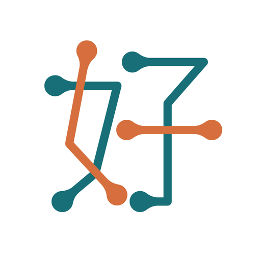

  

# Home Assistant integration for 中保好生活 package tracking and pickup

> **Unofficial integration.** Not affiliated with, endorsed by, or sponsored by 中興保全 (Taiwan Secom) or the operator of 中保好生活 (GoodLifeTaiwan) / glf.tw. All product and company names are trademarks of their respective holders.
>
> The API this integration relies on is undocumented and may change without notice. Use at your own risk. By using this integration you assert that you access only accounts you own and are entitled to.

## Features

- Per community — one Home Assistant device per 社區 you import, each with its own polling cadence, auth state, and pickup-code lifecycle.
- `sensor` — count of unpicked packages (full list as `items` attribute), current 5-digit pickup code, pickup-code expiry time, auth state.
- `image` — QR encoding of the current pickup code.
- `button` — request a fresh pickup code without leaving the UI.
- `number` / `switch` — CONFIG-category: per-community poll interval and an auto-regenerate-on-expiry toggle. No Options flow.
- Services — `goodlifetaiwan.request_pickup_code`, `goodlifetaiwan.send_sms`, `goodlifetaiwan.submit_code` (all response-capable).
- Events — `goodlifetaiwan_package_arrived` / `_picked` / `_auth_required` / `_auth_sms_sent` / `_auth_success` / `_auth_failed`.

## Installation

### HACS (recommended)

1. In HACS, go to **Integrations** → three-dot menu → **Custom repositories**.
2. Add `https://github.com/klh-homes/ha-goodlifetaiwan-packages` as an **Integration**.
3. Install **GoodLifeTaiwan Packages**, restart Home Assistant.
4. **Settings → Devices & Services → Add Integration**, search for _GoodLifeTaiwan_.

### Manual

Copy `custom_components/goodlifetaiwan/` into your Home Assistant `config/custom_components/` directory and restart.

## Configuration

Follow the config flow after adding the integration from the UI:

1. Enter the phone number registered with 中保好生活 (09XXXXXXXX or +886 format).
2. Enter the 6-digit SMS code you receive within 3 minutes.
3. If your account has more than one community, pick which to import.

Tokens are persisted in Home Assistant's `.storage/` and covered by HA backup. The access token refreshes automatically; the refresh token is valid 90 days. When re-auth is required the integration fires a `goodlifetaiwan_auth_required` event and HA shows a repair notification linking to the re-auth flow.

## Events, services, entities

See [`docs/`](./docs/) for full specs:

- [Events](./docs/events.md)
- [Services](./docs/services.md)
- [Installation](./docs/installation.md)
- [Configuration](./docs/configuration.md)
- [Examples](./docs/examples.md)

## Contributing

Pull requests welcome. All issues, PRs, and comments must be in English. See [`CONTRIBUTING.md`](./CONTRIBUTING.md) for dev setup, tests, and the live smoke-test script. Security issues: [`SECURITY.md`](./SECURITY.md).

## License

MIT
